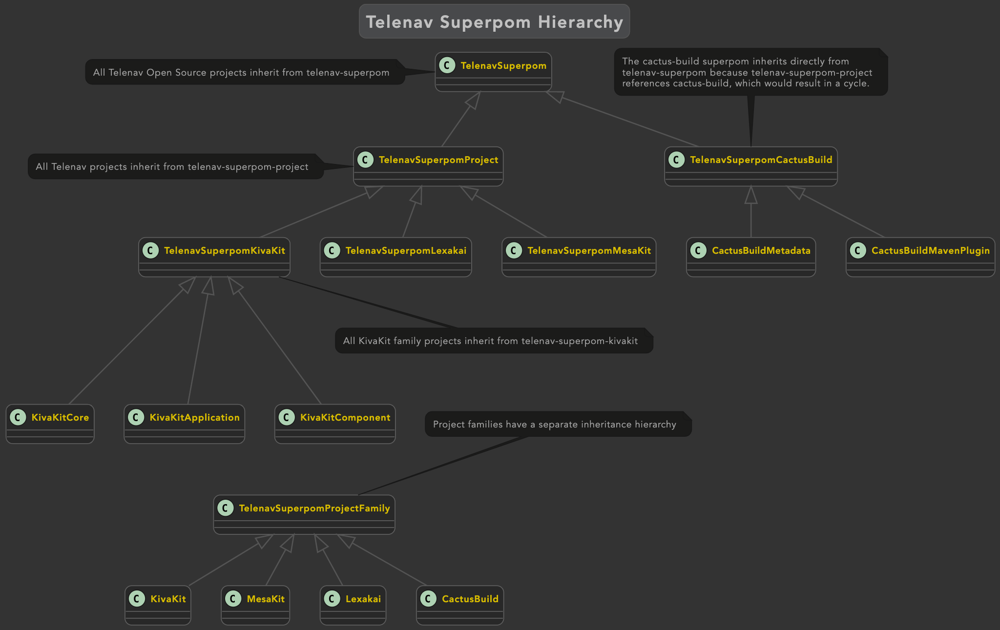

Telenav Superpom
================

This project contains a hierarchy of Maven superpoms defining how to build 
Telenav Open Source projects, including:

- kivakit
- mesakit
- lexakai
- cactus-build

### Releasing Telenav Superpoms to Maven Central

To release a new version of the Telenav superpoms to Maven Central:
 
1. In a shell window, run  `./release.sh` or `mvn -P sign-artifacts clean deploy`

2. Sign into [OSSRH](https://s01.oss.sonatype.org/#stagingRepositories), close the staging repository and release to Maven Central

3. Update any dependent projects, as appropriate

### The Telenav Superpom Hierarchy

The structure of the Telenav superpom hierarchy is shown in the diagram below. 

